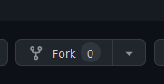

# Python Tutoring for Kate

This repository will hold the content for Kate's tutoring in Python while additionally teaching her GitHub Version Control, merging, etc.

## Steps:
1. First accept the invitation for collaboration via GitHub
	
2. Create a Fork
   

## In pycharm:

1. Get from VCS
2. Connect your GitHub account
3. Either search for, or enter the URL of your fork

You will now have an up-to-date repository, with this README.md, and three folders.

We will go from there.

:)

